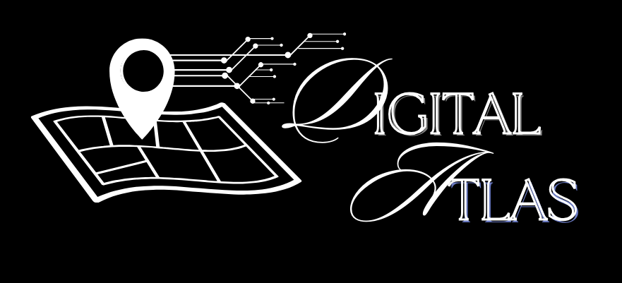

# 📍 Digital Atlas: Local Area Statistics and Insights Platform

<div align="center">
  
</div>

## 🗺️ Project Overview

**Digital Atlas** is a web-based application that offers users access to general and specific statistical information about locations across **Ireland**. The platform provides data-driven insights including local crime rates, school listings, transportation availability, amenities and property/rent prices. It aims to empower potential homeowners, business investors and curious residents with tools to analyse and compare areas using trusted Irish datasets.

---

## 👨‍💻 Team Members

| Name           | Email                         |
|----------------|-------------------------------|
| Jade Hudson    | jade.hudson5@mail.dcu.ie      |
| Sruthi Santhosh| sruthi.santhosh2@mail.dcu.ie  |

**Supervisor**: Dr. Yalemisew Abgaz

---

## ✨ Key Features

### 🔍 Area Search
- Search for specific areas by name to review area statistics and amenities

### 🧠 Data Insights
- Detailed statistics per area:
  - Local crime data
  - Transportation options available
  - Nearby schools and universities
  - Local amenities (via OpenStreetMap)
  - Average home and renting prices

### 💬 User Feedback
- Comment system for users to share experiences per area
- Community-generated insights to complement official data

---

## 📊 Data Sources
- [Central Statistics Office (CSO)](https://www.cso.ie)
- [Gov.ie](https://www.gov.ie)
- [OpenStreetMap](https://www.openstreetmap.org)


## 🛠️ Tech Stack

| Category             | Technology                                 |
|----------------------|---------------------------------------------|
| **Languages**        | Python, JavaScript, JSX, HTML, CSS          |
| **Frontend**         | React                                       |
| **Backend**          | Django                                      |
| **Testing**          | JEST, PyTest                                |
| **API Testing**      | Postman                                     |
| **Project Management**| Trello                                     |
| **IDE/Editor**       | Visual Studio Code                          |
| **Version Control**  | Git, GitLab                                 |

---

## 🛠️ Digital Atlas Documentation
Documentation on the application can be found here:
- [Project Proposal](https://github.com/jade211/Digital-Atlas/blob/main/proposal/CA326_Project_Proposal_Form.pdf)
- [Functional Specification](https://github.com/jade211/Digital-Atlas/blob/main/functional_spec/functional_spec.md)
- [User Manual](https://github.com/jade211/Digital-Atlas/blob/main/user_manual/user_manual.md)
- [Technical Specification](https://github.com/jade211/Digital-Atlas/blob/main/technical_manual/technical_spec.md)
- [Blogs detailing the development](https://dull-fireman-1d0.notion.site/CA326-DIGITAL-ATLAS-BLOGS-9e0d1527c13948109609c480bf36093b)

---

## 🚀 Installation & Setup

### Prerequisites and Required Software and Hardware Requirements

* Chrome/ Microsoft Edge Access.
* A PC that runs Windows 11.
* Linux or Windows Subsystem for Linux (WSL).
* The user has a working terminal and text editor installed (such as VS Code).
* The user has a stable internet connection.
* The user has a GitLab account
* Installed Node.js and npm: Download and install Node.js from [here](https://nodejs.org/). This will also install npm.
* Installed Python and pip: Download and install Python from [here](https://www.python.org/). Make sure to check the box that says "Add Python to PATH" during installation.

### Step-By-Step Guide

**Step 1: Cloning the Repository**

Open your terminal and run the following command to clone the repository from the Digital Atlas repository on GitLab.

```git clone git@github.com:jade211/Digital-Atlas.git```

**Step 2: Installing Dependencies (Backend)**

Install the required dependencies for backend functionality.

```cd DigitalAtlas/code/backend/digitalatlas```
```pip install -r requirements.txt```

If there are difficulties downloading from the requirements.txt file, these are the following dependencies needed for the backend.
``` pip install djangorestframework```
```pip install django-cors-headers```
```pip install pytest-django```


**Step 3: Make Migrations**
Navigate to the backend section of the folder and apply migrations to set up the backend database
```cd DigitalAtlas/code/backend/digitalatlas```
```python 3 manage.py makemigrations```
```python3 manage.py migrate```


**Step 4: Run the Django Server**
Start the Django development server:
```python manage.py runserver```


**Step 5: Installing Dependencies (Frontend)**
Navigate into the repository through the following commands and run npm install to automatically download the Digital Atlas dependencies.
``` cd DigitalAtlas/code/frontend/atlas```
```npm install```


**Step 6: Run the React Server**
Start the react development server
```npm start```


**Step 7: Access the website**

Open a web browser (such as Chrome) and type in http://localhost:3000 to view the contents of the website.


