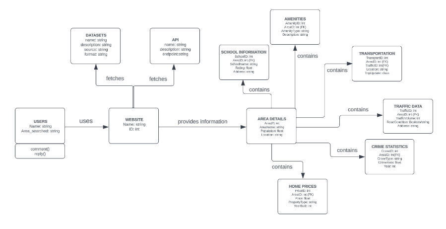

# Software Requirements Specification (SRS) Template

The document in this file is an annotated outline for specifying software requirements, adapted from the IEEE Guide to Software Requirements Specifications (Std 830-1993).

Tailor this to your needs, removing explanatory comments as you go along. Where you decide to omit a section, you might keep the header, but insert a comment saying why you omit the data.

## CA326 - Digital Atlas
Jade Hudson and Sruthi Santhosh

### Software Requirements Specification Document
#### Version: (1)	Date: (20/11/2023)

## Table of Contents

1. [Introduction](#introduction)
    1.1 [Purpose](#purpose)
    1.2 [Scope](#scope)
    1.3 [Business Context](#business-context)
    1.4 [Glossary: Definitions, Acronyms, and Abbreviations](#glossary-definitions-acronyms-and-abbreviations)
    1.5 [References](#references)
    1.6 [Overview](#overview)
2. [The Overall Description](#overall-description)
    2.1 [Product Perspective](#product-perspective)
        2.1.1 [System Interfaces](#system-interfaces)
        2.1.2 [Interfaces](#interfaces)
        2.1.3 [Hardware Interfaces](#hardware-interfaces)
        2.1.4 [Software Interfaces](#software-interfaces)
        2.1.5 [Communications Interfaces](#communications-interfaces)
        2.1.6 [Memory Constraints](#memory-constraints)
        2.1.7 [Operations](#operations)
        2.1.8 [Site Adaptation Requirements](#site-adaptation-requirements)
    2.2 [Product Functions](#product-functions)
    2.3 [User Characteristics](#user-characteristics)
    2.4 [Constraints](#constraints)
    2.5 [Assumptions and Dependencies](#assumptions-and-dependencies)
    2.6 [Apportioning of Requirements](#apportioning-of-requirements)
3. [Specific Requirements](#specific-requirements)
    3.1 [External Interfaces](#external-interfaces)
    3.2 [Functions](#functions)
        3.2.1 [Operational Scenarios / Use Cases](#operational-scenarios-use-cases)
    3.3 [Performance Requirements](#performance-requirements)
    3.4 [Logical Database Requirement](#logical-database-requirement)
        3.4.1 [System Architecture / Domain Model Diagram](#system-architecture-domain-model-diagram)
    3.5 [Design Constraints](#design-constraints)
        3.5.1 [Standards Compliance](#standards-compliance)
    3.6 [High-Level Design](#high-level-design)
    3.7 [Software System Attributes](#software-system-attributes)
        3.7.1 [Reliability](#reliability)
        3.7.2 [Availability](#availability)
        3.7.3 [Security](#security)
        3.7.4 [Maintainability](#maintainability)
        3.7.5 [Portability and Preliminary Schedules](#portability-and-preliminary-schedules)
    3.8 [Organizing the Specific Requirements](#organizing-the-specific-requirements)
        3.8.1 [System Mode](#system-mode)
        3.8.2 [User Class](#user-class)
        3.8.3 [Objects](#objects)
        3.8.4 [Features](#features)
        3.8.5 [Stimulus](#stimulus)
        3.8.6 [Response](#response)
        3.8.7 [Functional Hierarchy](#functional-hierarchy)
    3.9 [Additional Comments](#additional-comments)
4. [Change Management Process](#change-management-process)

# 1. Introduction

## Purpose
The product specified in this document is the Digital Atlas website. The purpose of this website is to deliver general statistics about an area and user feedback opportunities to users in a concise and comprehensive way. The website will provide information relevant to the user all in one place, saving the user time searching for particular pieces of information. The intended audience of this service will be users interested in purchasing property in a particular area, business owners and current residents of the area. The information presented on the website will allow these users to make informed decisions on their actions relevant to their situation.

## 1.2 Scope
The product to be discussed is the Digital Atlas website. The scope of this project details how we plan on providing searchable general statistics information, filtering features, and user feedback services for users interested in local information about specific areas. This will involve the gathering of the information to be displayed as well as the implementation of both the user feedback section and the filtering options available. The benefits of this website will include but are not limited to:
    -Providing relevant information in one, easily accessible place .
    -Delivering a method of prioritisation to users who would like to search for areas depending on their own personal area criterias.
    -Allowing users to interact with other users, giving them the opportunity to ask for advice on any queries or concerns about an area of interest.
    -Allowing users living in a specified area the opportunity to        communicate with fellow neighbours.
The goal of this website is to deliver a user experience that allows for fast access to relevant information. We plan on expanding this project further to include more information.

## 1.3 Business Context
The first business context of our website revolves around being an independent, real estate support website. This is a unique idea that has not been developed before. It provides a multitude of statistics in one location. Our website caters towards offering general statistics about areas of interest to users within Ireland. It is aimed towards user who are planning on purchasing a home/ starting a business in an area, or users who are trying to find areas that fit their living criteria(s). Our website also caters towards users who are interested in discovering general statistics about an area. Such users may be residents living in the specified area, or users researching an area(s).

Another business context of Digital atlas is possibly partnering up with a business with a similar target market. Websites such as Daft.ie, MyHome.ie etc provide data on current home prices and the rates on inflation on area pricings. This data combined with the information found on our websites would be a profitable partnership for both businesses.

A further business context to consider is the prospect of having internal advertisements found within the website. This would offer a source of potential income for Digital Atlas. 

## 1.4 Glossary: Definitions, Acronyms, and Abbreviations
| Term | Description |
|------|-------------|
| SRS | Software Requirements Specification |
| API | Application Programming Interface |
| CSO | Central Statistics Office |
| OSM | Open Street Map |
| ADA | Americans with Disabilities Act |
| GTFS | General Transit Feed Specification |
| NTA | National Transport Authority |

## 1.5 References
[1] [Datasets - Data.Gov.IE](https://data.gov.ie/dataset/) (accessed Nov. 29, 2023).  
[2] [Home - National Transport Authority](https://www.nationaltransport.ie/) (accessed Nov. 21, 2023).  
[3] [Databases - CSO - Central Statistics Office](https://www.cso.ie/en/databases/) (accessed Nov. 21, 2023).  
[4] [OpenStreetMap](https://www.openstreetmap.org/#map=7/53.465/-8.240) (accessed Nov. 29, 2023).  

## 1.6 Overview
The remainder of this document contains all of the necessary information to do with Digital Atlas. Section 2 contains all of our goals and user information. For developers, all our information regarding setup and implementation can be found at the bottom in Section 3. 

This document is organized into 3 Sections: 
    Section 1 contains the introduction to the document and a brief explanation of Digital Atlas as well as necessary terms used and references. 
    Section 2 contains all information directed to customers and stakeholders pertaining to our goals and user information. 
    Section 3 contains all of the necessary information regarding the requirements of the software (for developers). Each section has its own series of subsections.

# 2. The Overall Description
## 2.1 Product Perspective

Digital Atlas aims to provide users with general statistics and user feedback about different areas. The product is not independent and self-contained, but rather a component of a larger system that involves data from external sources, web servers, and web browsers. The product interacts with external interfaces such as APIs and datasets to deliver its functionality. The product is a commercial product that aims to provide a practical and user-friendly service, rather than a research prototype that aims to demonstrate a new concept or technique.

Digital Atlas is comparable to other websites that offer information about areas such as Google Maps, Daft, and TripAdvisor. What makes our website different is that it focuses on general statistics about an area, such as local housing prices, education, transportation, crime rate, etc, rather than one specific point of interest, such as restaurants or attractions. Our website is more of an amalgamation of information found on multiple websites displayed in one place, with a specialization in assisting potential home/business owners.

Digital Atlas also allows users to filter areas based on their own criteria, such as school availability, affordability, safety etc rather than having to primarily rely on their own research or ratings. Furthermore, the website enables users to interact with other users who have experience living in the area / who can answer their questions about an area, rather than only displaying user reviews or ratings.

The product targets users who are interested in purchasing property, starting a business, or living in an area, rather than users who are looking for travel or entertainment options.

### 2.1.1 System Interfaces
#### External Interfaces (HTTP Based API’s and Datasets)
- **Gov.ie:** The official government website of Ireland. It provides various government services, information, and resources. Digital Atlas harnesses the Attractions dataset and the Primary schools dataset from here.
- **Central Statistics Office / CSO:** The Central Statistics Office (CSO) is the national statistical agency of Ireland. It is responsible for collecting, analysing, and disseminating statistical information about various aspects of the country, including demographics, economics, and social trends. Digital Atlas queries the Crime dataset to gather crime statistics.
- **OpenStreetMap / OSM:** OpenStreetMap is a collaborative mapping platform that allows users to view, edit, and use geographic information freely. Digital Atlas leverages the National Roads Travel Times API to provide transport information locally. 
- **IrelandStats.com:** Is a website providing comprehensive user data about social and public life in Ireland. From this website we are using the schools datasets to provide education services data.
- **National Transport Authority:** They provide public transport APIs for Ireland. From this website we will be using the General Transit Feed Specification (GTFS) - RealTime API.

## 2.1.2 Interfaces

### Homepage Interface:
- **About Information:** The homepage will display a brief breakdown of what services Digital Atlas provides and a simple description of how a user can search for their queried location / criteria.
- **Search Bar:** A simple search bar providing the functionality the user needs to search for their desired area.
- **Criteria boxes:** Boxes that the user can check / uncheck providing amenities / facilities in an area that may be of interest such as schools, house prices, etc.
- **Navigation bar:** A navigation bar will be present at the top of the page containing links to travel to other pages of the website such as the About page and the Contact page.

### Searched Area Interface:
- **Statistical Data:** Data will be displayed on the screen pertinent to the area searched. Statistics such as the local price of a home, education, transport, crime etc will be found here.
- **User Feedback/Commenting:** Allows the user to share their thoughts on the area. Users can also read the comments of other users which could also be a source of advice/ further understanding of the area. This also aids in adding a sense of community to the webpage.

### Contact Page:
- **Email box:** An email submission box will be provided to allow users to contact in the event that they require assistance. This can also be used to provide a place for feedback on what statistics should further be provided on the website.

### Accessibility:
- The above user interfaces will also comply with the ADA standards for web accessibility, such as providing alternative text for images, captions for videos, keyboard navigation, and colour contrast. The user interfaces are also responsive and adaptive to different devices, such as desktops, laptops, tablets, or smartphones. The user interfaces are also tested and evaluated by users and experts to ensure usability, accessibility, and satisfaction.

## 2.1.3 Hardware Interfaces
- The system has no hardware interface requirements. It operates through web browsers (Chrome, Microsoft Edge, Safari, etc) across multiple platforms (Linux, Windows) and is compatible with various devices such as PCs, laptops, phones and lab machines.

## 2.1.4 Software Interfaces

#### Central Statistics Office Crime Dataset
- **Name:** Central Statistics Office (CSO)
- **Mnemonic:** CSO
- **Specification number:** Not applicable
- **Version number:** Not applicable
- **Source:** CSO
- **Discussion:** The CSO dataset holds crime statistics for the specified region. The website accesses this dataset to gather crime-related data.
- **Interface Definition:** The system uses internal methods to access the CSO dataset, retrieving crime statistics.

#### Gov.ie
- **Name:** Gov.ie Schools and Amenities Datasets
- **Mnemonic:** None
- **Specification number:** Not applicable
- **Version number:** Not applicable
- **Source:** Gov.ie
- **Discussion:** The Gov.ie datasets are used to access school and traffic data within specified areas.
- **Interface Definition:** The system uses internal methods to access the Gov.ie datasets, retrieving school and local amenities.

#### OpenStreetMap API
- **Name:** National Roads Travel Times API
- **Mnemonic:** None
- **Specification number:** Not applicable
- **Version number:** Not applicable
- **Source:** OpenStreetMap
- **Discussion:** OpenStreetMap API is employed to retrieve amenity-related information for specific regions. It provides details about various amenities available in the area.
- **Interface Definition:** Queries made through HTTP requests to OpenStreetMap endpoints for amenity data retrieval.

#### General Transit Feed Specification API(GTFS)
- **Name:** General Transit Feed Specification 
- **Mnemonic:** GTFS
- **Specification number:** Not applicable
- **Version number:** Not applicable
- **Source:** National Transport Authority
- **Discussion:** GTFS API is used to retrieve transportation information for specific regions. It provides details on various transportations mode available in an area.
- **Interface Definition:** Queries made through HTTP requests to GTFS API endpoints for transportation data retrieval.

## 2.1.5 Communications Interfaces

The Digital Atlas website primarily operates over standard web communication protocols and interfaces. As such, the HTTP and HTTPS protocols via the internet serve as the primary means of communication. The interactions occur through typical web request-response mechanisms without specific custom protocols. The application does not use or build any special communication protocols. The website does not involve any distinct network protocols or communication interfaces beyond standard web-based interaction.

## 2.1.6 Memory Constraints

The Digital Atlas website primarily operates as a web-based application and does not have specific memory constraints on primary or secondary memory within the user environment. Because it is a web-based platform, memory utilisation depends on the user's device and the server architecture that hosts the programme.

The website's design does not impose fixed memory constraints on user machines. Instead, it operates within the memory limits typical of modern web applications. Because web-based interactions are dynamic, the target design and operation of Digital Atlas do not require any minimum system requirements or memory constraints.

## 2.1.7 Operations

### Interactive and Unattended Operations:
- Digital Atlas primarily functions in interactive mode where users engage with the site to gather information about specific areas in Ireland. It does not require extended unattended operations as it is primarily user-driven and responsive.

### Data Processing Support:
- While the system does not perform extensive data processing, it needs to handle data retrieval from trusted sources (CSO, Gov.ie, OSM) efficiently. This requires robust querying of APIs and datasets based on user input.

### User Interaction Management:
- The system needs to support the comment section, allowing users to leave feedback and insights. Moderation tools or mechanisms to manage and review these comments might not be necessary.

## 2.1.8 Site Adaptation Requirements

### Data Source Configuration:
- Prior to system activation, the website’s existing database server needs to be configured to accommodate new data tables required for Digital Atlas functionality. These tables will store fetched data from Irish datasets and APIs.

### Software Setup:
- The software components – Django, React, and MySQL Workbench – should be installed on designated server machines compatible with Chrome, Microsoft Edge, Linux, and Windows platforms.

### API Connectivity:
- Necessary configuration and access authorizations need to be set up for connectivity with external APIs, such as those provided by the CSO, Gov.ie, and OSM and NTA. This includes validating API keys and authentication methods required for data retrieval.

### Version Compatibility:
- Confirm that all software tools used for development – Visual Studio Code, GitLab, JEST, PyTest, and Postman – are compatible and updated to their latest version across the development team’s machines.

### User Accessibility:
- Ensure the website is usable across various devices and browsers (Chrome, Microsoft Edge, Safari) to cater to a large demographic of users. Perform compatibility tests on PCs, lab machines to ensure wide accessibility.

## 2.2 Product Functions

- **Search for Areas:** Allows the user to input and search for a specific area of interest. The user will type in the area, click on the correct option that appears as a result and be directed to that area's information page. This is done via a Search Bar placed at the top of the Homepage.

- **About Information:** This is a section found on the Homepage explaining how to use the website. This section will include the search bar mechanics explained above and also how the user can find areas of interest by using the criteria matching boxes.

- **Specification matching user criteria:** Digital Atlas also provides a filtering service through the use of criteria boxes. If a user would like to search for an area based on their own specifications, they may use this service to be provided with areas that contain these specifications. Specifications include but are not limited to; school availability, crime rate, local traffic, etc.

- **Website Navigation:** A navigation bar is provided on the interfaces of the website to allow users the ability to access other pages on the website. Pages such as the homepage and the contact page can be found here.

- **Statistical Data displayed:** Once a user has chosen an area, they will be redirected to that area's individual page detailing the area statistics. Statistics such as the average price of a home, education opportunities, traffic, amenities, attractions and crime rate of the locality will be found here. This information will be laid out in a user friendly way as the main aspect of the page is to provide information to a large target audience. 

- **Commenting/User Feedback Section:** Allows the user to comment on the specific area. This also allows users to view other comments made by other users about this area. Users also have the opportunity to respond to other user comments by clicking into the comment and clicking rh reply button.This comment section has a dual purpose, both doubling as a space where users can pose queries to residence in the area, and can also be used by residents in the area to get to know their neighbours / discuss local events or issues

- **Email Submission Box:** An open communication between users and website maintenance. Users can provide issues about the website or any feedback / data they would like added to the website.

## 2.3 User Characteristics

### Educational Level
- **Description:** The intended users of Digital Atlas may have a diverse educational background. Digital Atlas is a website aimed at multiple demographics, and as such there is not a required educational level needed to use the website services. Users may have a high level of education or more of a practical understanding.
- **Impact on Design:** Considerations for users of various educational backgrounds will be prioritised and the design should accommodate this. Visual elements will be elevated to display the data in a clear, understandable manner, as well as keeping statistical/technical jargon and terms to a minimum. 

### Experience
- **Description:** The experience of the users of Digital Altas may vary. The website is geared towards allowing users to make informed decisions regarding property and local area statistics.
    -Some users may be familiar with property knowledge and may have purchased property before, whereas some users may be first time buyers or may be individuals exploring areas for investment opportunities.
    -Some users may be residents of the specified area, whereas some may be interested in learning more about an area.

- **Impact on Design:** The statistical information will be laid out in a clear manner to inform all users of the data found on a particular area. There will also be the criteria boxes service, allowing new home-owners the opportunity to find areas based on their own particular criteria if they are not familiar with the property market prior to searching.

### Technical Expertise
- **Description:** The demographic of users expected to utilise Digital Atlas will be vast and will not require a high level of technical experience. Many users may be familiar with advanced features of technology, whereas some may only have basic knowledge. Our website will have a simple layout to ensure consistency so that understanding how to use the service is possible for all users. 
- **Impact on Design:** Users with less technical experience will require a more simple and straightforward interface. With our services being laid out in a way that is easy to find and navigate around, this will accommodate those users.

### Accessibility
- **Description:** The accessibility of users may vary depending on their specific needs. Some users may be able to access all resources on the website without difficulty, whereas others may not. 
- **Impact on Design:** Ensuring the website is able to cater for a wide target market, incorporating features such as alternative text for images, an intuitive site navigation bar as well as large, clear text will be a priority. As the platform relies on datasets and APIs, ensuring the website is compatible across different browsers and devices (Chrome, Edge, Linux, Windows) is crucial. This accommodates users accessing the site from various platforms.

### Impact on Internal System Design
- **Adaptability:** The system should have the ability to adjust to different user preferences and criteria. This is pertinent to the service, allowing users to customise their area searches based on individual needs and priorities.
- **User Interaction Design:** The design should facilitate user interactions, considering the potential for users to share comments and feedback. Including a comment section fosters user engagement and allows individuals to share insights and experiences. This community-driven approach can influence decision-making for other users, making it essential to create an accessible and easy-to-use comment feature. User-generated content should be managed effectively to enhance the overall user experience.
- **Testing:** A diverse user market implies the need for all-inclusive testing and evaluation. For testing, this will allow users with different characteristics to provide feedback on the website's structure to ensure the system's usability and effectiveness.

## 2.4 Constraints

- **Regulatory Policies:** Ensure compliance with data protection laws and regulations governing the use and dissemination of information. For example, adhere to data privacy laws handling user data and statistical information.
  
- **Hardware Limitations:** Optimise the website’s performance for various hardware specifications and internet connection speeds to ensure seamless user experience across different devices.

- **Interface to Other Applications:** Ensure seamless integration with APIs and datasets from different sources (Central Statistics Office, Gov.ie, Open Street Map) to gather accurate and updated information.

- **Reliability Requirements:** Maintain consistent and reliable access to datasets and APIs to guarantee accurate information for users accessing the website.

- **User Accessibility:** Ensure the website is designated to be accessible to users with disabilities, aligning with accessibility standards such as ADA.

- **Performance:** Optimise the website’s performance for responsiveness, especially when dealing with queries and fetching data from external sources to minimise loading times.

- **Compatibility:** Ensure compatibility across various browsers (Chrome, Microsoft Edge), operating system (Linux, Windows), and devices (PC, Lab Machines) to reach a wider user base without functional inconsistencies.

## 2.5 Assumptions and Dependencies

- **Data Availability:** An assumption is that the datasets from the Central Statistics Office, Gov.ie, and OpenStreetMap will be regularly updated and consistently available. The accuracy and dependability of the information on the website could be impacted by any disruption or unavailability in these datasets.

- **API Stability:** Reliance on the reliability and consistent functioning of the APIs provided by the mentioned sources. Modification or termination of these APIs may have an impact on data retrieval, which could alter the website’s functionality.

- **Technological Changes:** The technologies utilised, such as Python, JavaScript, and associated frameworks and tools, are assumed to be stable and consistent, with the expectation that they will remain compatible and support future updates.

- **User Engagement:** An assumption is that users will actively engage with the comment section to provide insights. Reliance on user involvement may have an impact on the depth and calibre of information accessible to other users.

- **Development Tool Suitability:** Reliances on the efficiency and dependability of the programming tools (e.g. Django, React, Visual Studio Code) that are thought to be appropriate for the entire development process.

- **Browser and Operating System Compatibility:** Presumptions about Chrome, Microsoft Edge, Linux, and Windows as reliable platforms for user engagement. The functionality and user experience of the website may be impacted by modifications or problems with these platforms.

- **Team Collaboration:** Requires efficient cooperation and communication between members of the team while managing tasks and version control with Trello and Git. Any communication breakdowns could hinder the project’s development.

## 2.6 Apportioning of Requirements

### Immediate Development

- **Basic Functionality:** Implementing the core functionalities such as data extraction from trusted sources (Central Statistics Office, Gov.ie, OpenStreetMap), displaying essential features including area-specific information, search functionality, and user comment section.

- **User Interface:** Designing an intuitive user interface to facilitate website interaction and easy navigation.

- **Backend and Frontend Development:** Establishing the backend logic in Python (using Django) and frontend development with JavaScript (using React) to make sure the website’s fundamental architecture works.

- **Data Query and Display:** Ensuring dependable datasets and API queries in order to present correct data depending on the user-inputed area.

- **Testing:** Conducting preliminary testing on several platforms (Chrome, Microsoft Edge) and operating systems such as Linux and Windows to ensure basic functionality and usability. 

### Deferred to Future Versions

- **Advanced Features:** Including more complex features such as personalised user accounts, auto-complete searching, advanced data visualisation, or additional data sources other than the original reliable ones.

- **Enhanced User Interaction:** Extending features for user interactions, including advanced feedback mechanisms or community forums.

- **Performance Optimization:** Conducting additional performance and speed optimisation particularly for complex queries or huge datasets. 

- **Extended Platform Support:** Extending support to additional platforms or browsers that were not originally covered by the main scope.

## 3. Specific Requirements

### 3.1 External Interfaces

1. **Digital Atlas Website Interface:**
    - **Description:** Interfaces for users to access and navigate the website and services.
    - **Purpose:** Providing access to information on local statistics such as the average price of a home, schools, traffic, amenities and crime for a specified area in Ireland.
    - **Source/Destination:** Web-based interaction between the user and the website.
    - **Valid Range/Accuracy/Tolerance:** N/A
    - **Units of Measure:** N/A
    - **Timing:** Real-time interaction based on user queries and inputs.
    - **Relationships to Other Inputs/Outputs:** Interacts with backend APIs (Central Statistics Office, Gov.ie, OpenStreetMap, GTFS) for fetching and displaying area-specific data.
    - **Screen Formats/Organization:** Homepage with explanatory information, navigation bar, search bar, specific area details, comment section, contact page.
    - **Window Formats/Organization:** N/A (Assuming browser-based interaction)
    - **Data Formats:** Displayed data in readable and intuitive formats (text, tables, maps).
    - **Command Formats:** N/A (Assuming graphical user interface interaction)
    - **End Message:** Confirmation is the area details displaying, comment(s) posted.

2. **Backend APIs (Central Statistics Office, Gov.ie, GTFS API, OpenStreetMap):**
    - **Description:** APIs providing data for the average price of a home, crime statistics, school information, traffic data, and amenities.
    - **Purpose:** Supply reliable and relevant information for specified areas in Ireland.
    - **Source/Destination:** Communication between the website and respective external APIs.
    - **Valid Range/Accuracy/Tolerance:** Based on the accuracy and timeliness of data from external sources.
    - **Units of Measure:** N/A
    - **Timing:** Dependent on the responsiveness of the external APIs.
    - **Relationships to Other Inputs/Outputs:** Provide requested data based on user queries received from the website.
    - **Data Formats:** JSON, XML, or the specified formats.
    - **Command Formats:** HTTP requests (GET, POST).
    - **End Message:** Response data sent back to the website for display.

## 3.2 Functions

### Functional Requirements

- The system shall allow the user to search for an area and be redirected to that area's information page.
  - *Criticality level:* H

- The system shall allow the user to filter areas based on their specific criteria.
  - *Criticality level:* H

- The system shall allow users to interact with other users through the comment / feedback section found below each area page.
  - *Criticality level:* H

- The system shall gather its information from the specified API’s and datasets detailed in the specification.
  - *Criticality level:* H

- The system shall have a responsive design, ensuring optimal user experience across various devices and screen sizes.
  - *Criticality level:* M

- The system shall regularly update its datasets and external APIs to ensure the information is current and accurate.
  - *Criticality level:* M

- The system shall allow users to communicate feedback to Digital Atlas through email via the contact page.
  - *Criticality level:* M

- The system shall provide an option for users to report inappropriate or misleading comments or information.
  - *Criticality level:* M

- The system shall provide an autocomplete feature in the search bar for quicker and more accurate location input.
  - *Criticality level:* L

- The system shall allow the user to navigate through the website via the navbar at the top of the page.
  - *Criticality level:* L

### 3.2.1 Operational Scenarios / Use Cases

## Use Case: User searches for a particular area

**Actors:** User, System  
**Trigger:** User wants to see the statistics for the named area  
**Pre-Conditions:** User has internet access. User has an area they would like to search.  
**Post-Conditions:** The user is successfully redirected to the area contents page.  

### Success Scenario

| USER | SYSTEM |
|------|--------|
| User clicks the search bar and types in the name of the area | |
| | User clicks on the area’s name in the search bar |
| | System acknowledges the user's request and redirects to that area's page. |

**Quality Requirements:** The user does not lose internet access for the duration of the process.

---

## Use Case: User searches for areas based on specific criteria

**Actors:** User, System  
**Trigger:** User wants to see a list of areas containing the specified criteria selected  
**Pre-Conditions:** User has internet access. User has area specifications that they would like included in the area search.  
**Post-Conditions:** The user is successfully provided with a list of areas that satisfy their criteria. User is redirected to the area contents page.  

### Success Scenario

| USER | SYSTEM |
|------|--------|
| User clicks the filter button and selects the boxes that suit their criteria | |
| | System acknowledges and processes the user's selected criteria(s) |
| | System produces a list of areas that meet this criteria |
| User clicks on an area that interests them | |
| | System acknowledges the user's request and redirects to that area's page. |

**Quality Requirements:** The user does not lose internet access for the duration of the process.

---

## Use Case: User creates a comment

**Actors:** User, System  
**Trigger:** User has a question about an area and wants advice / wants to provide feedback on an area.  
**Pre-Conditions:** User has internet access. User is on an area page  
**Post-Conditions:** The User successfully posts a comment on the area page  

### Success Scenario

| USER | SYSTEM |
|------|--------|
| User clicks the comment button and provides a comment | |
| | System acknowledges the action and posts the comment |
| | Other users are able to see the comment appear in the feedback section. |

**Quality Requirements:** The user does not lose internet access for the duration of the process.

---

## Use Case: User replies to another user's comment

**Actors:** User1, User2  
**Trigger:** User1 sees User2's comment and wishes to respond  
**Pre-Conditions:** User1 has internet access. User1 is on the same area page as User2. User1 has a response to User2  
**Post-Conditions:** The User1 successfully posts a reply to User2’s comment.  

### Success Scenario

| USER1 | USER2 |
|-------|-------|
| | User2 clicks the comment button and provides a comment |
| User1 sees User2’s comment and decides to respond | |
| | User1 clicks the reply button on User2’s comment and submits their response. |

**Quality Requirements:** The user does not lose internet access for the duration of the process.

### 3.3 Performance Requirements

#### Static Numerical Requirements:

- **Number of Simultaneous Users:** The system should accommodate a minimum of 100 simultaneous users accessing area-specific information without compromising performance.
  
- **Information Handling:** The system should efficiently handle and display a variety of data, including crime statistics, school data, traffic information, amenities, and home prices for various areas within Ireland.

- **Response Time:** 95% of area-specific data queries should turn within 3 seconds or less to ensure a responsive user experience.

#### Dynamic Numerical Requirements:

- **Transactions and Queries:** The system should process a minimum of 500 queries per hour during normal usage and up to 1000 queries per hour during peak times, ensuring consistent performance.
  
- **Data Processing:** In order to provide users with up-to-date information, data processing for statistical and information retrieval should handle at least 100,000 data records each day.
  
- **Comment Section Interaction:** Without experiencing any performance reduction, the comment section should handle a minimum of 50 user interactions (comments, replies, etc.) everyday.

### 3.4 Logical Database Requirement

#### Entities:

- The system will manage various data entities such as “Area Details”, “Crime Statistics”, “School Information”, “Traffic Data”, “Transport information”, “Amenities”, and “Home Prices”. Each entity will have attributes relevant to its category.

#### Relationships:

- Relationships between data entities will be established. For instance, “Area Details” will associate with “Crime Statistics,” “School Information,” “Traffic Data,” “Amenities,” and “Home Prices” based on the user's specified area.

#### Data Integrity:

- Implementing constraints such as preventing null values in data fields and maintaining referential integrity among related data entities.

#### Data Retention:

- Specifying the duration of which user comments and interaction are retained within the system to maintain relevancy and manage database size efficiently.

### 3.4.1 System Architecture / Domain Model Diagram

### 3.5 Design Constraints

#### 3.5.1 Standards Compliance

**Standard Compliance:**

- **Data Naming Conventions:** Consistency and clarity are ensured by adhering to particular naming rules for data entities and properties.
  
- **API Usage:** Compliance with policies and standards on API usage and data retrieval methods established by data sources (e.g., Central Statistics Office, Gov.ie, OpenStreetMap).

**Audit And Traceability:**

- **Data Integrity Auditing:** Mandating periodic audits to guarantee data integrity, especially when fetching and displaying statistical data from external sources.

### 3.6 High-Level Design

### 3.7 Software System Attributes

#### 3.7.1 Reliability

**Data Accuracy:**

- **Requirements:** The system shall maintain accurate and up-to-date information for all areas and user interactions.
  
- **Verification:** Regular data validation checks and comparisons with trusted external sources to verify the accuracy of information.

**Error Handling:**

- **Requirement:** The system shall effectively handle errors, providing meaningful error messages to users.
  
- **Verification:** Testing scenarios with intentional errors and ensuring the system responds appropriately with clear error messages.

**Performance Stability:**

- **Requirement:** The system shall exhibit stable performance under varying user loads, preventing performance deterioration during peak usage.
  
- **Verification:** Load testing the system with simulated concurrent users and monitoring performance metrics to ensure stability.

#### 3.7.2 Availability

**Recovery Time:**

- **Requirement:** The system shall allow users to restart the application after a failure.
  
- **Verification:** Testing the system’s recovery process, ensuring minimal data loss and efficient restart functionality.

#### 3.7.3 Security

*Not Applicable because the website does not deal with user data.*

#### 3.7.4 Maintainability

**Modularity:**

- **Requirement:** The system shall be designed with reusable components to facilitate ease of maintenance.
  
- **Verification:** Code review and analysis to ensure the modular structure of code blocks and independence of components.

**Documentation:**

- **Requirement:** The system shall have comprehensive documentation to assist future maintainers.
  
- **Verification:** Regular updates to documentation and validation of its completeness.

**Interface Consistency:**

- **Requirement:** The system shall maintain consistent interfaces to ease integration of future updates.
  
- **Verification:** Testing the consistency of interfaces and ensuring backward compatibility.

### 3.7.5 Portability and Preliminary Schedules

**Portability:**

#### Gantt Chart:

- **Correctness (H):**
  - **Rationale:** Correctness is given a high priority because the information provided by Digital Atlas needs to be accurate.
  - **Testing:** Ensuring the APIs and datasets are constantly reviewed and providing up-to-date information.

- **Efficiency (M):**
  - **Rationale:** While efficiency is important, it is not the primary focus. Ensuring the software performs optimally is considered a medium priority.
  - **Testing:** Monitoring website speed and optimizing critical sections of code.

- **Flexibility (M):**
  - **Rationale:** While flexibility is an important aspect, it is not a primary necessity for the website to run currently, therefore it has Medium priority. This medium priority allows for adaptability to changes without compromising current operations.
  - **Testing:** Evaluating the ease of introducing new features without disrupting currently functioning code.

- **Integrity/Security (L):**
  - **Rationale:** Low priority as the main objective of the website is to provide general statistics on an area and providing a place for user interaction. No sensitive personal information is being dealt with.
  - **Testing:** Not Applicable.

- **Maintainability (M):**
  - **Rationale:** A moderate emphasis is placed on maintainability to ensure future updates and modifications can be carried out efficiently.
  - **Testing:** Reviewing the modularity and documentation for ease of maintenance.

- **Portability (H):**
  - **Rationale:** Given the potential need for the website to run on various web browsers and operating systems, prioritizing high portability is essential.
  - **Testing:** Regular testing on different web browsers and operating systems and ensuring compatibility. Measuring the percentage of host-dependent code.

- **Usability / User Interface (H):**
  - **Rationale:** Usability is given high priority as it focuses more on user interaction and experience which is the main goal of Digital Atlas.
  - **Testing:** Assessing the effort required to learn, operate, and interpret the output.

#### Preliminary Schedule:

**November - December**
- Gathering necessary APIs and Datasets needed to provide the general statistics for the website.
- Downloading all packages and required software, etc., to allow for the development of the website.
- Constructing the Function Specification and project proposal.
- Updating blog entries.

**December - January**
*Early December*
- Beginning the backend development of the website.
- Configuring the APIs and ensuring access tokens to be able to fetch the required data.
- Test API links and ensuring data retrieval.
- Adding the dataset information to the databases in MySQL workbench.
- Updating blog entries.

*Late December*
- Frontend development will begin.
- Ensuring the functionality of the area search bar is completed.
- Completing the criteria box functionality.
- Creating the page dedicated to each area using React.
- Creating and configuring the contact page in an email.
- Testing the search-bar functionality to ensure it leads to a working page dedicated to the selected area.
- Component Testing of the functions created.

**January - February**
- Adding comment section functionality to each area page.
- Attempting to add a reporting feature to the comments section.
- Attempting to add autocomplete in the search bar configuration.
- Creating a Technical Specification.
- Component Testing of the commenting functionality.
- Overall System Testing.
- Prioritizing User Testing after passing system testing.

**February**
- Creating a User Guide.
- Video Walkthrough.
- Further User Testing.
- Submission.

### 3.8 Organizing the Specific Requirements 

#### 3.8.1 System Mode
The website may operate in different modes:
- **User mode:** Regular users interact with the interface to access area-specific information.
- **Admin mode:** Administrative users manage comments, user interactions, and possibly have editing capabilities.

#### 3.8.2 User Class
Different classes of users have varied access and capabilities:
- **Regular users:** Access information, view area statistics, and leave feedback.
- **Administrative users:** Moderate comments, manage user interactions, and possibly edit information.

#### 3.8.3 Objects
Objects within the system:
- **Area Details:** Attributes include crime statistics, school information, traffic data, amenities, and home price, etc.
- **Comment and Feedback:** Attributes include user input, timestamps, and area associations.

#### 3.8.4 Features
Each feature may include:
- **Search feature:** Sequence of inputs (area input) leading to the display of area details and related information.
- **Comment section:** Input (user feedback) leading to the display of comments for other users.

#### 3.8.5 Stimulus
The system functions in response to stimuli:
- **User input of area:** Triggers fetching of area-specific information.
- **User comment submission:** Triggers storing and displaying feedback.

#### 3.8.6 Response
Functions within the system support generating responses:
- **Fetching data:** Responds to user queries by displaying area-specific information.
- **Displaying comments:** Responds to user submissions by displaying feedback on the website.

#### 3.8.7 Functional Hierarchy
If none of the above organizational schemes prove helpful, the overall functionality can be organized into a hierarchy:
- **Inputs:** User queries for area information.
- **Outputs:** Display of area-specific statistics and information.
- **Internal data access:** Retrieval and manipulation of data from Irish datasets and APIs.

### 3.9 Additional Comments
*NOT APPLICABLE*

**Change Management Process**

1. **Change Identification:** Changes may be identified through various channels:
   - Talks within the team about developments in the project or technical issues.
   - Customer requests or demands submitted formally through designated channels, such as emails through the Contact page.

2. **Change Log and Evaluation:** Following detection, modifications are recorded and assessed for how they may affect the SRS:
   - The team evaluated the suggested modifications for their viability, effect on the project objectives.
   - Technical compatibility and alignment with current functionalities are assessed for each change.

3. **Updating the SRS:** Following review and approval, a change receives the required updates:
   - Modifications that reflect the changed criteria or project scope are formally documented in the SRS.
   - The change’s specifics, including its effect and justification, are recorded for future use.

4. **Change Control and Communication:** Control mechanisms are in place to manage changes:
   - Before implementing modifications, the team must formally approve them.
   - A common understanding is maintained when changes are successfully conveyed to all team members.

5. **Submission of Changes:**
   - To keep a formal record, team changes may adhere to comparable documentation procedures.

6. **Review and Consensus:**
   - The team reviews each suggested modification as a whole to decide how best to proceed with its implementation.
   - Consensus ensures that changes align with project objectives and are technically possible.

