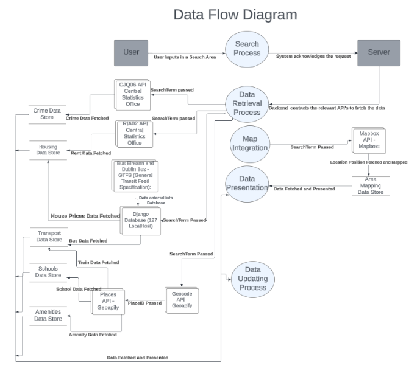
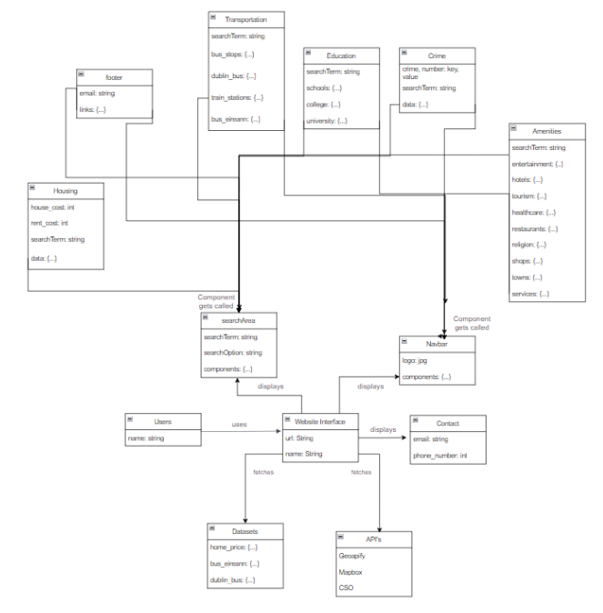

# Technical Specification: Digital Atlas
*By Jade Hudson and Sruthi Santhosh*  
*Date: 18/02/2024*


## Table of Contents
1. [Introduction](#introduction)	2
   - [Overview](#overview) 2
   - [Glossary](#glossary) 2
2. [System Architecture](#system-architecture) 3
   - [High Level Overview](#high-level-overview) 3
     - [Backend](#backend) 3
     - [Frontend](#frontend) 3
   - [Distribution of Functions](#distribution-of-functions) 4
   - [Reused or 3rd Party Components](#reused-or-3rd-party-components) 4
3. [High-Level Design](#high-level-design) 6
   - [Data Flow Diagram](#data-flow-diagram) 6
   - [Object Model](#object-model) 7
4. [Problems and Resolution](#problems-and-resolution) 9
5. [Installation Guide](#5-installation-guide) 10
   - [Prerequisites and Required Software and Hardware Requirements](#prerequisites-and-required-software-and-hardware-requirements) 10
   - [Step-By-Step Guide](#step-by-step-guide) 10
   - [Dependencies List and Version](#dependencies-list-and-version) 11

## Introduction
### Overview
Digital Atlas is a user-centric website that offers local statistical insights and information pertaining to housing, amenities, education, transportation and crime across Ireland. The platform integrates both frontend and backend components to allow for this functionality.

#### Key Features
* A search page that allows users to enter an area of interest and be presented with a map detailing the location of the area, as well as features of interest such as local amenities, schools, crime, transport and housing prices.
* Interactive user interface designed with a homepage, contact page, search page and individual feature pages.
* Navigation bar to allow for easy access to specific features and pages within the website.
* Data presentation of the features offered based on the user's input.
* API interaction for user queries and Django usage for storing and retrieving statistics


### How it Works:
1. **User Input:** Users will input an area (town or county) into the search bar and click search.
2. **Data Retrieval:** AreaSearch component fetches the data modules for crime, transport, housing, amenities, and schools. Or, if the user is accessing data from the navbar in the individual feature components, the user will input in their specific area and receive information pertaining to that particular category of interest in that area.
3. **API Interactions:** Backend interacts with CSO, Geoapify, and Mapbox APIs for accurate data retrieval.
4. **Data Presentation:** Processed data is presented on frontend pages, providing comprehensive statistics.


### Glossary
- **CSO**: Central Statistics Office
- **GTFS**: General Transit Feed Specification
- **API**: Application Programming Interface: Allows different software systems to communicate with each other.
- **MSW**: Mock Service Worker: A library that helps simulate API responses during testing.
- **Backend**: Refers to the server-side of the application, which processes user requests.
- **Frontend**: The user interface and user experience part of the application.
- **Geocoding**: The process of converting location-based information, such as addresses or place names, into geographic coordinates (latitude and longitude).
- **Component**: A modular and self-contained unit of the system responsible for specific functionality.


## System Architecture

### High Level Overview

This section offers a high level overview of how the major components of Digital Atlas work seamlessly together to deliver a user-focused platform. Digital Atlas features a well-defined architecture that encompasses both frontend and backend components, seamlessly working together to provide users with a robust and interactive platform.

#### Backend

**Data processing and API External Interaction:** Our website uses five API’s that fetch statistics for the different sections of the website. The backend of our website handles the user queries that are received through the relevant search bars and integrates with the correct API to fetch the data. The API’s we have used are detailed below:
* CJQ06 Recorded Crime Incidents - Central Statistics Office (CSO)
* RIA02 RTB Average Monthly Rent Report - CSO
* Geocode API - Geoapify API
* Places API - Geoapify API
* Mapbox Geocoding API - Mapbox

**Databases:** Our backend has utilised Django to store information relevant to statistics such as the transport information and housing prices. The databases we have taken this information from include:
  * HPA02 Residential Dwelling Property Transactions - Central Statistics Office
  * Bus Eireann - GTFS Transport For Ireland Public Transport Information
  * Dublin Bus - GTFS Transport For Ireland Public Transport Information


#### Frontend

**User Interface:** Digital Atlas’s frontend is responsible for providing the main interactive user interface. This includes the various web pages (such as the homepage, search page, and different statistics pages) as well as an interactive map for seamless user interactions.

**Navigation Bar:** The navigation bar offers easy access to different sections of the website, including the homepage and the contact page, as well as a link to each separate component relating to a particular feature. A user can click these statistics individually to further search an area of interest. Each statistic component is equipped with a dedicated search bar for specific queries.

**Main Search Functionality:** Users first input a location. After the search button is clicked, this triggers the setting of the search term and the frontend components of each feature component (school, transport, amenities, crime and housing) and the data for that area is returned and interactable - providing real-time, relevant information for that area.

**User Feedback Section:** Enables users to provide feedback and insights on specific areas, fostering a sense of community engagement


Overall Overview: A user will input their area of interest, whether it be a town or county in Ireland. The frontend components will then be triggered and will process the users searchterm and search option - which will send the fetch query to backend. The backend processes then queries and fetches the data from the relevant API’s and datasets and prepares the response. Processed data is then presented on the frontend web pages - showcasing the fetched statistics for that area. Users can then leave comments on that particular area.

### Distribution of Functions

#### Search Area Component
* Search Functionality: The core search functionality is concentrated within the SearchArea component. When users enter a specific area into the search bar on the main page, this component initiates the process of retrieving data related to that area.
* Data Retrieval: The SearchArea component dynamically calls specialised modules for crime, transport, housing, amenities, and schools to fetch relevant data specific to the entered location.


#### Modules in the AreaSearch Component:
* Crime Module: Manages the functionality related to retrieving and presenting crime statistics for a given area.
* Transport Module: Handles the data retrieval and presentation of transportation-related information in the specified area including local bus stops, Bus Eireann buses, Dublin Bus and Train Station information.
* Housing Module: Focuses on fetching and displaying housing-related statistics for the searched location such as average home and rent costs.
* Amenities Module: Manages the collection and presentation of data regarding local amenities available in the specified area.
Schools Module: Specifically deals with retrieving and showcasing information related to schools, colleges and universities within the searched region.
* Footer Module: A designated component at the bottom of every page detailing the website's email as well as links to the homepage, search page and contact page.


#### Navbar Components:

* Homepage and Contact Section: Allows the user to access the homepage and contact pages.
* Individual Statistics Pages: The navbar component is equipped with links that direct the user to pages dedicated to the main features of the website (Crime, Transport, Housing, Amenities, Schools). These components all contain their own search bars to allow users to directly search for information within the corresponding category, providing a focused and efficient user experience.


### Reused or 3rd Party Components:

#### Geocode API - Geoapify API:

* Purpose: This API is utilised for geocoding purposes, converting location-based information (like addresses or place names) into geographic coordinates (latitude and longitude) and Place_ID numbers.
* Functionality: Geoapify API contributes to the system's ability to process user queries involving location-based information through the use of the Place_Id and county value.


#### Places API - Geoapify API:

* Purpose: Similar to the Geocode API, the Places API from Geoapify provides information about places, points of interest, and other location-based details.
* Functionality: Enhances the system's capability to fetch and display information about local amenities and places within a specified area.


#### Mapbox Geocoding API - Mapbox:

* Purpose: This API, provided by Mapbox, is used for displaying the entered location on the map, which involves converting location-based queries into geographic coordinates.
* Functionality: Supports the system's interactive map features and assists in processing location-based queries.


#### Central Statistics Office (CSO) APIs:

* Purpose: These APIs, such as CJQ06 (Recorded Crime Incidents) and RIA02 (RTB Average Monthly Rent Report), are sourced from the Central Statistics Office (CSO) to gather official statistical data.
* Functionality: Facilitates the retrieval of accurate and up-to-date statistical information related to crime incidents and average monthly rent, contributing to the comprehensive data presented on Digital Atlas.


#### Bus Eireann and Dublin Bus - GTFS (General Transit Feed Specification):

* Purpose: These GTFS datasets are used to provide public transport information for Ireland, specifically from Bus Eireann and Dublin Bus.
* Functionality: Enables the system to incorporate and display information about public transportation, enhancing the user's understanding of transport options in a given area.


## High Level Overview

### Data Flow Diagram



### Object Model



Digital Atlas operates in an environment where various system components interact with external entities, APIs, and databases to collect and showcase relevant information. The key components engaged in these interactions include:

#### Frontend

- **Navbar**: Containing links to different sections of the website. The statistical components found in the navbar are individual, and each have their own search bar dedicated to searching for specifics regarding that area in that category of interest. They provide more detailed information than their counter components found in the Search page. The component links found on the navbar are as follows: Homepage, Contact page, Search Page, Amenities, Education, Crime, Transport, Housing, Contact Page.

- **Homepage**: Serves as the entry point for users, initiating interactions. It contains a link to each of the facilities mentioned in the navbar, those being Amenities, Education, Crime, Transport, Housing. There is also a search bar found on the homepage that links to the search bar found on the search page. This allows the user to enter their area of interest on the homepage as well as the search page and be redirected to the results found in the components on the search page.

- **Search Page**: Facilitates user queries by triggering backend processes. The search page has a dedicated search bar that links to all components through the search term entered by the user. There is also a search option selected by the user to specify whether the area entered is a town or a county. The component links found on this page are as follows: Map, Amenities, Education, Crime, Transport, Housing, Footer.

- **Footer**: The Footer component contains links back to the Homepage, the Search page and the Contact page. The footer is called in all component pages, such as the Homepage, Search page, Amenities page, School page, Crime page, Transportation page, Housing page and Contact page.

#### Backend

- **Data Processing and API Interaction**: Manages user queries received from the frontend search bars by using fetch requests to get the data from the API’s. The API organisations used include the CSO, Geoapify and Mapbox.

- **Databases**: Uses Django for efficient storage and retrieval of statistics. The database is filled with information from databases such as the CSO and Transport For Ireland.

#### External Entities

- **CSO (Central Statistics Office)**:
  * Provides crime incidents data (API: CJQ06).
  * Offers average monthly rent reports (API: RIA02).

- **Geoapify API**:
  * Fetches the PlaceID from the area name (Geocode API).
  * Fetches places data based on the PlaceID (Places API).

- **Mapbox Geocoding API**:
  - Assists in allowing the user to see the area mentioned on the map.

#### Communication Channels

- **Backend to Frontend**: 
* User types a query area into the search bar and then clicks search - setting the searchTerm.
* This searchTerm is passed to the relevant API or API database found in the component


- **Frontend to Backend**: 
* The API fetches the data for that specified area and sends back the data to be displayed.

**Example: The Transport Component Page**
  * The user enters an area of interest into the search bar at the top of the page and clicks search.
  * The search term is set and this is then fed to the Geoapify Geocode API. The API with this location then returns a Place ID  number which then gets sent to the Geoapify Places API to return bus stops in that area.
  * The search term is also sent to the Django backend API database containing information on Bus Eireann and Dublin bus from the GTFS Transport For Ireland Public Transport Information database by way of a fetch request.
  * Both of these data sets are returned and presented on the frontend component.


## Problems and Resolution

### Incorporating Towns into Search

**Problem:** Our primary objective for the website was to facilitate user inputs of specific areas into the search bar, generating data from various features outlined on the website. Initially, we configured all components to process county data exclusively, meaning users could input a county and receive relevant data. However, we aimed to enhance user experience by incorporating towns into the search functionality. This was challenging because not all of our data contained town specific data.

**Resolution:** To achieve this, we leveraged the Geoapify Geocode API. This API generates a unique Place ID code for the specified area. We then used the Geoapify Places API to find data surrounding the area such as amenities, train stations, schools, etc. For components not using the Places API, this was particularly challenging as some of our datasets did not have town specific statistics, such as the housing price database. To address this, we employed the Geocode API to retrieve the county of the town associated with the entered area. From this we were able to then access our database to retrieve and present data relevant to the county, ensuring a comprehensive and error-free user experience.

### Transportation Data

**Problem:** At the beginning of the project, identifying a suitable API for the transportation components posed a challenge. Subsequently, we discovered the Transport for Ireland GTFS API, an API resource that aligned with our transportation data requirements. However, accessing the data proved difficult even after obtaining an API key. 

**Resolution:** Facing challenges in fetching location-specific data through the GTFS API, we came up with an alternative solution. Instead of relying solely on the GTFS API, we explored two datasets independently published by the API, specifically detailing the transportation links of Bus Éireann and Dublin Bus, which we added to our Django backend database. To incorporate train station data and bus stop data we used the Geoapify Geocode and Geoapify Places API into our system.

### Filtering Features

**Problem:** In the early stages of development, we considered incorporating a filtering feature as a potential functionality on our website. However, we encountered challenges due to the diverse sources of our data. Identifying features/amenities of a specific kind posed significant difficulties, particularly in transforming this information into a functional filtering feature. 

**Resolution:** To address this issue, we decided to create separate components in the navigation bar, allowing users to directly navigate to individual features. Additionally, we also divided the features up into subcategories to allow users to click into the category type that they were interested in.

### Comment Section

**Problem:** In the architectural design of our comments section, we envisioned a user-friendly feature enabling users to submit comments, questions, or information specific to a designated area. The implementation of this feature into the backend of our code proved quite difficult as we were approaching our deadline. 

**Resolution:** Currently, our commenting feature, accessible on the search page, facilitates user interactions by allowing comments, replies, and anonymous liking or disliking of comments. However at present, this functionality is not directly linked to our backend system. Integrating this feature with the backend would be an objective for future development iterations.

### CSO Server Crash

**Problem:** During the final stages of code refinement, we encountered an issue where the CSO PXStat Server experienced technical issues, resulting in a complete server outage. Consequently, two of our APIs (pertaining to crime and rent) were rendered inaccessible, leading to a temporary disruption in data retrieval. 

**Resolution:** The issue was resolved when the server came back online approximately five hours later

## 5. Installation Guide

### Prerequisites and Required Software and Hardware Requirements

* Chrome/ Microsoft Edge Access.
* A PC that runs Windows 11.
* Linux or Windows Subsystem for Linux (WSL).
* The user has a working terminal and text editor installed (such as VS Code).
* The user has a stable internet connection.
* The user has a GitLab account
* Installed Node.js and npm: Download and install Node.js from [here](https://nodejs.org/). This will also install npm.
* Installed Python and pip: Download and install Python from [here](https://www.python.org/). Make sure to check the box that says "Add Python to PATH" during installation.

### Step-By-Step Guide

**Step 1: Cloning the Repository**

Open your terminal and run the following command to clone the repository from the Digital Atlas repository on GitLab.

```git clone https://gitlab.computing.dcu.ie/hudsonj5/2024-ca326-jhudson-digitalatlas.git```

**Step 2: Installing Dependencies (Backend)**

Install the required dependencies for backend functionality.

```cd DigitalAtlas/2024-ca326-jhudson-digitalatlas/code/backend/digitalatlas```
```pip install -r requirements.txt```

If there are difficulties downloading from the requirements.txt file, these are the following dependencies needed for the backend.
``` pip install djangorestframework```
```pip install django-cors-headers```
```pip install pytest-django```


** Step 3: Make Migrations **
Navigate to the backend section of the folder and apply migrations to set up the backend database
```cd DigitalAtlas/2024-ca326-jhudson-digitalatlas/code/backend/digitalatlas```
```python 3 manage.py makemigrations```
```python3 manage.py migrate```


** Step 4: Run the Django Server **
Start the Django development server:
```python manage.py runserver```


** Step 5: Installing Dependencies (Frontend) **
Navigate into the repository through the following commands and run npm install to automatically download the Digital Atlas dependencies.
``` cd DigitalAtlas/2024-ca326-jhudson-digitalatlas/code/frontend/atlas```
```npm install```


** Step 6: Run the React Server **
Start the react development server
```npm start```


**Step 7: Access the website **

Open a web browser (such as Chrome) and type in http://localhost:3000 to view the contents of the website.

**Step 8: Viewing the backend API database**

Open a web browser (such as Chrome) and type in http://127.0.0.1:8000 to view the contents of the backend databases
You can also create an admin account to modify these databases by navigating back to the backend directory and running the following commands:
``` cd DigitalAtlas/2024-ca326-jhudson-digitalatlas/code/backend/digitalatlas```
```python3 manage.py createsuperuser ```

There is also a premade admin login:
Username: digitalatlas
Password: project@2024


**Step 9: Testing**

To test the frontend components, you can navigate to the frontend directory and run the following command:
``` cd DigitalAtlas/2024-ca326-jhudson-digitalatlas/code/frontend/atlas```
```npm test ```
To test the backend files, you can navigate to the backend directory and run the following command:
``` cd DigitalAtlas/2024-ca326-jhudson-digitalatlas/code/backend/digitalatlas/info```
```pytest tests.py ```


### Dependencies List and Version

**Python:**
- Python 3.8.10

**NodeJS:**
- v19.4.0

**Npm:**
- 9.2.0

**Pip:**
- pip 20.0.2

**Django:**
- 4.1.6

**Djangorestframework:**
- 3.14.0

**django-cors-headers:**
- 3.14.0

**Other Frontend Dependencies:**
- @testing-library/user-event": ^13.5.0
- bootstrap: ^5.3.2
- chart.js: ^4.4.1
- mapbox-gl: ^3.1.2
- react: "^18.2.0
- react-chartjs-2: "^5.2.0
- react-dom: "^18.2.0
- react-icons: "^5.0.1
- react-router-dom: ^6.22.0
- react-scripts": 5.0.1
- web-vitals: ^2.1.4
- @testing-library/jest-dom: ^6.4.2
- @testing-library/react: ^14.2.1
- msw: ^2.2.1

### Dependency Commands Ran During the Process

- pip install djangorestframework
- pip install django-cors-headers
- npm install bootstrap
- npm install react router-dom
- npm install react-icons
- npm install react-chartjs-2@latest chart.js@latest
- npm install mapbox-gl
- npm install --save-dev @testing-library/react @testing-library/jest-dom
- npm install msw --save-dev
- pip install pytest-django
